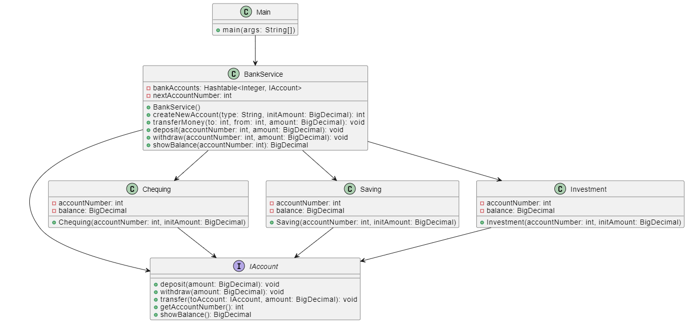

# Multi-Account Banking System with Facade Pattern

This Java project demonstrates the implementation of a multi-account banking system using the Facade Design Pattern. The system comprises three types of accounts: Checking, Saving, and Investment. Users can perform various banking operations like checking balances, making deposits, and withdrawing funds through a simplified facade interface.

## Table of Contents

- [Project Overview](#project-overview)
- [Getting Started](#getting-started)
- [Usage](#usage)
- [Contributors](#contributors)


## Project Overview

The project is organized into several classes:

- `Customer`: The main class demonstrating the banking system's functionality.
- `BankService`: The facade class that provides simplified access to banking operations.
- `IAccount`: An interface defining common banking operations.
- `Checking`, `Saving`, and `Investment`: Implementations of account types.

## Getting Started

To run this project locally, follow these steps:

1. Clone the repository to your local machine:

   ```bash
   git clone https://github.com/forhanShahriarFahim/Assignment-3-Multi-Account-Banking-System-with-Facade-Pattern.git
   javac *.java
   java Main

## Usage
Upon running the program, you will be presented with a menu where you can choose various banking operations:

 - Check Account Balance
 - Deposit Funds
 - Withdraw Funds
 - Exit

Select the desired operation and follow the on-screen prompts to provide input for account type and transaction amount.

## Contributors
Forhan Shahriar Fahim

## UML Class Diagram



This UML class diagram illustrates the structure of the multi-account banking system and its relationships between classes.
